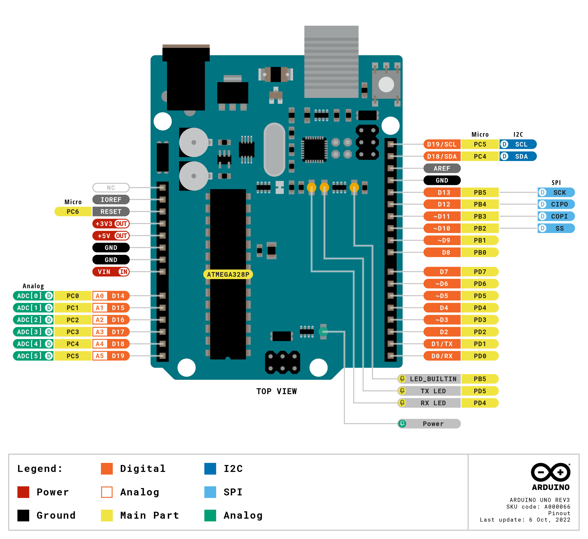

Este repositório concentra todo o material e pesquisa para auxiliar futuras implementações.

# Documentação:
- [Fabricante - Arduino](https://www.arduino.cc/)
- [DevKits](https://store-usa.arduino.cc/collections/boards)
- Datasheets e Esquematico: em /docs

## Pinout:

- [Footprints, Symbols e Pachges 3D (p/ o Kicad)](https://github.com/Alarm-Siren/arduino-kicad-library)

# Exemplos e Tutoriais:
## Configurando a IDE
- [Arduino IDE ](https://www.arduino.cc/en/software)

- [Como usar a extensão Arduino no Visual Studio Code](https://maker.pro/arduino/tutorial/how-to-use-visual-studio-code-for-arduino)

# API e Biliotecas:
- [Language Reference](https://www.arduino.cc/reference/en/)
- [Bibliotecas Oficiais](https://www.arduino.cc/reference/en/libraries/)

## Millis()
- [API millis() (Documentação da biblioteca Arduino)](https://www.arduino.cc/reference/pt/language/functions/time/millis/)
