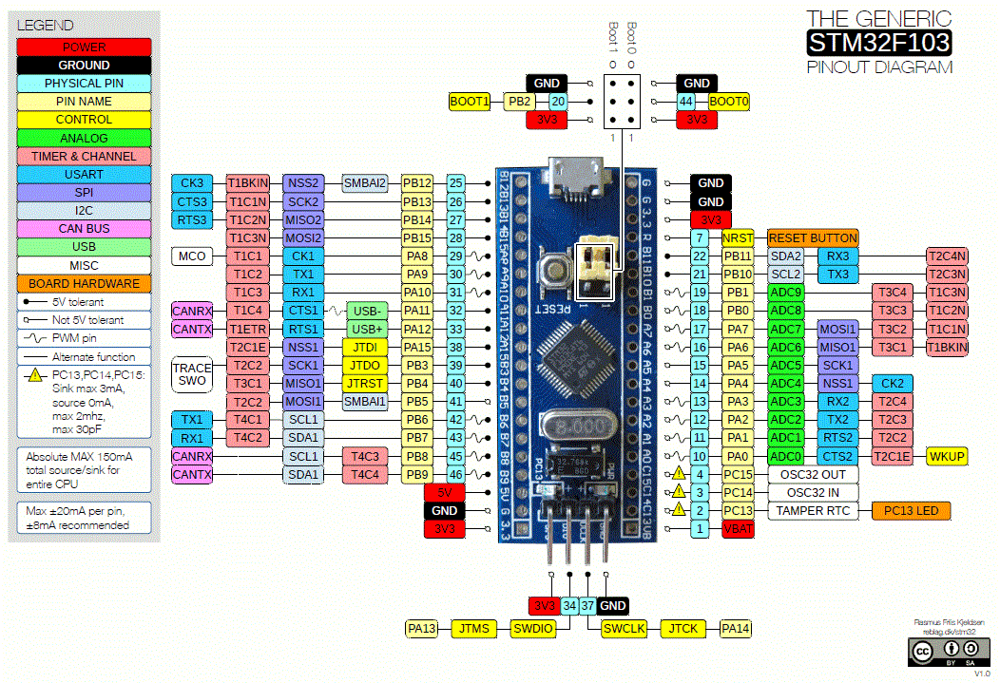

Este repositório concentra todo o material e pesquisa para auxiliar futuras implementações.

# Documentação:
- [Fabricante - STMicroelectronics](https://www.st.com/content/st_com/en/stm32-mcu-developer-zone.html)
- [DevKits](https://stm32-base.org/boards/)
- [STM32 MCUs](https://www.st.com/en/microcontrollers-microprocessors/stm32-mainstream-mcus.html)
- [Blue Pill](https://stm32-base.org/boards/STM32F103C8T6-Blue-Pill.html)
- Datasheets e Esquematico: em /docs

### Pinout:

[Footprints, Symbols e Pachges 3D (p/ o Kicad)](https://github.com/yet-another-average-joe/Kicad-STM32)

# Exemplos e Tutoriais:
### Configurando a IDE
- STM32CubeIDE: 
    1. [Download](https://www.st.com/en/development-tools/stm32cubeide.html#st_description_sec-nav-tab)

    2. [Tutorial de Instalação no linux](http://techawarey.com/ubuntu/install-stm32cube-ide-in-ubuntu-linux-mint-step-by-step-guide/)

    3. [User manual](https://www.st.com/resource/en/user_manual/dm00403500-stm32cubeprogrammer-software-description-stmicroelectronics.pdf)

- STM32CubeProgrammer
    1. [Download](https://www.st.com/en/development-tools/stm32cubeprog.html).
    2. Instalação:
        -   Windows: apenas siga os passos do instalador
        -   Linux (Ubuntu/Mint):
        > 1. Extraia o conteúdo do arquivo baixado (/home/name_user/Downloads) e mova até o diretório /opt/STMicroelectronics (crie se necessario), usando os seguintes comandos:
         ~~~bash
        cd /opt
        mkdir STMicroelectronics

        cd /home/name_user/Downloads
        tar xvf en.stm32cubeprog-*.tar.gz 
        sudo mv en.stm32cubeprog-* /opt/STMicroelectronics
        ~~~
        > 2. Crie um link simbólico do arquivo "STM32CubeProgrammer" para o diretório "/usr/local/bin/".
        ~~~bash
        sudo ln -s /opt/STMicroelectronics/en.stm32cubeprg-*/STM32CubeProgrammer /usr/local/bin/
        ~~~
        > 3 .Execute o arquivo de instalação usando o comando abaixo e depois siga as instruções na tela para concluir a instalação.
        ~~~bash
        cd /opt/STMicroelectronics/en.stm32cubeprg-*
        sudo ./SetupSTM32CubeProgrammer-*.linux
        ~~~
        > 4. Para iniciar, navegue até o diretório de instalação e execute o arquivo "STM32CubeProgrammer".

- Usando o Arduino IDE:
    1. Considerando que a IDE já está instalada corretamente, adicione nas preferencias o link para o repositorio das placas.
       >Versão da STMicroelectronics (recomendado): [STM32 MCU based boards (version 2.0.0)](https://github.com/stm32duino/BoardManagerFiles/raw/main/package_stmicroelectronics_index.json)  
        >Versão do Dan Drown:[STM32F4xx boards (version 2020.1.17)](http://dan.drown.org/stm32duino/package_STM32duino_index.json)

    2. Abra o Gerenciador de Placas e instale a "STM32 MCU based boards" por STMicroelectronics ou a "STM32F1 Boards (Arduino_STM32)", dependento de aqual repositorio de boards foi escolhido.

    3. Neste ponto a Arduino IDE já compila os codigos do STM32 (bluepill), mas para carregar/enviar o mesmo para a placa ainda é necessario instalar o STM32CubeProgrammer.

    4. Para os sistemas linux os passos são os mesmos descritos acima, com a diferença da necessidade de configura a variavel de ambiente PATH como o caminho para 

- Recursos extras:  
    - Drives: [Arduino_STM32](https://github.com/rogerclarkmelbourne/Arduino_STM32)

    - [Arduino_Core_STM32](https://github.com/stm32duino/Arduino_Core_STM32)

    - Gravação dos programas: 
        >[Usando o programador FTDI(converso USB p/ serial TTL)](https://capsistema.com.br/index.php/2020/12/12/introducao-ao-stm32-circuito-azul-usando-arduino-ide-led-piscando/#Preparando_o_IDE_Arduino_para_STM32_Blue_Pill)
        >[Usando o gravador LINK ST (interface SWD)](https://www.filipeflop.com/blog/stm32-com-ide-a)
        >Usando a porta micro-USB (tem que grava o bootloader para habilitar).

### Introdução

- [Ebook-Filipeflop](https://www.filipeflop.com/img/files/download/Descobrindo%20o%20STM32.pdf)
- [Conhecendo o STM32 ou Bluepill](https://www.curtocircuito.com.br/blog/arm/conhecendo-o-bluepill-stm32)

- [Tutorial DEEPBLUE MBEDDED](https://deepbluembedded-com.translate.goog/stm32-arm-programming-tutorials/?_x_tr_sl=en&_x_tr_tl=pt&_x_tr_hl=pt-BR&_x_tr_pto=sc)
- [Tutorial com STM32CubeIDE](https://www.youtube.com/playlist?list=PLjOLyDltrTdk7XqeOdhzxLlAY12-DiLUI)

- [Tutorial da MicroPeta(youtube)](https://www.youtube.com/playlist?list=PL5e8EBlOu5_P_RV5HJfVLYniii4qZYcp4)

# API e Biliotecas:
- [API do stm32duino](https://github.com/stm32duino/wiki/wiki/API#spi)

### GPIO 
- [Exemplo de leitura do ADC - DMA / Interrupt / Polling (usando o CubeIDE)](https://deepbluembedded-com.translate.goog/stm32-adc-read-example-dma-interrupt-polling/?_x_tr_sl=en&_x_tr_tl=pt&_x_tr_hl=pt-BR&_x_tr_pto=op,sc)

- [Tutorial com STM32CubeIDE: Primeiros passos e CMSIS Core com GPIO](https://embarcados.com.br/stm32cubeide-primeiros-passos-e-cmsis-core-com-gpio/)

### Timer Interrpt
 
- [STM32_TimerInterrupt (biblioteca arduino)](https://www.arduino.cc/reference/en/libraries/stm32_timerinterrupt/)

- [Descrição do STM32F1 HAL e drivers de camada baixa](https://www.st.com/resource/en/user_manual/dm00154093-description-of-stm32f1-hal-and-lowlayer-drivers-stmicroelectronics.pdf)

- [Exemplo 01 - HAL (biblioteca do STM32Cube IDE)](https://microcontrollerslab-com.translate.goog/stm32-blue-pill-timer-interrupt-stm32cube-ide-hal-libraries/?_x_tr_sl=en&_x_tr_tl=pt&_x_tr_hl=pt-BR&_x_tr_pto=sc)
- [Exemplo 02 - HAL (biblioteca do STM32Cube IDE)](https://deepbluembedded-com.translate.goog/stm32-timer-interrupt-hal-example-timer-mode-lab/?_x_tr_sl=en&_x_tr_tl=pt&_x_tr_hl=pt-BR&_x_tr_pto=sc)

### Comunicação SPI - Card SD
- [stm32duino/STM32SD library](https://www.arduinolibraries.info/libraries/stm32duino-stm32-sd)
- [stm32duino/FatFs library](https://github.com/stm32duino/FatFs)
-[How to use SD card with stm32 and SdFat library](https://www.mischianti.org/2022/10/24/how-to-use-sd-card-with-stm32-and-sdfat-library/)
- [SD CARD using SPI in STM32 || Cube-IDE || File handling || uart](https://www.youtube.com/watch?v=spVIZO-jbxE) 
- [STM32CubeIDE SD CARD. SPI with STM32F103C8T6](https://www.youtube.com/watch?v=aqSNz26Cuio&ab_channel=MicroPetabyNizarMohideen), [doc](https://www.micropeta.com/video29)

### Comunicação Usart 
- [Exemplo de Comunicação UART entre STM's](https://www.youtube.com/watch?v=TJaHRDkYzCo&ab_channel=MicroPetabyNizarMohideen), [+](https://www.micropeta.com/video22)

### RTC
- [Usando o RTC interno do STM32f103c8t6](http://ruyjorje.blogspot.com/2016/07/usando-o-rtc-interno-do-stm32f103c8t6.html)

# Link Uteis:
- [Configurar para gerar o arquivo .bin](https://embarcados.com.br/stm32cubeide-primeiros-passos-e-cmsis-core-com-gpio/#:~:text=pinos%20do%20PORTB.-,Configurando%20processo%20de%20compila%C3%A7%C3%A3o%20e%20download%20do%20firmware%20via%20debugging%20mode,-Depois%20de%20efetuar)
- [Erro ao conectar o stm32 com o STM32 ST-Link Utility](https://www.youtube.com/watch?v=FbGOg6gRQqA)
- [Como usar "servidor GDB ST-link"](https://copyprogramming.com/howto/how-do-i-use-st-link-gdb-server)
- [ST Link Update](https://www.youtube.com/watch?v=Tt-eyglKpIs&ab_channel=Weblearning)
